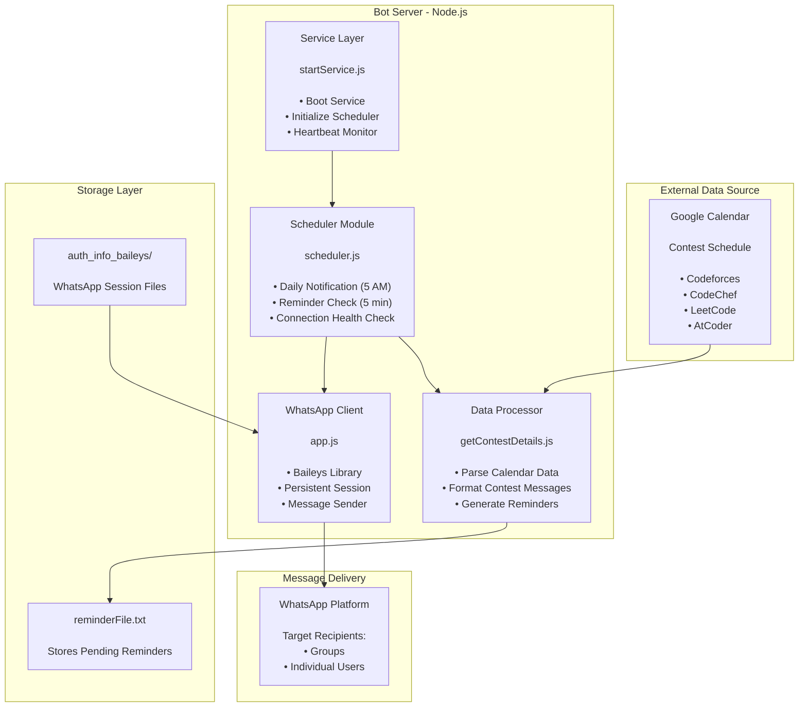
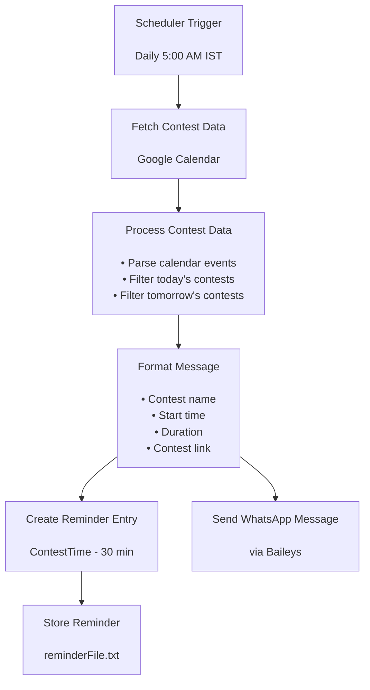
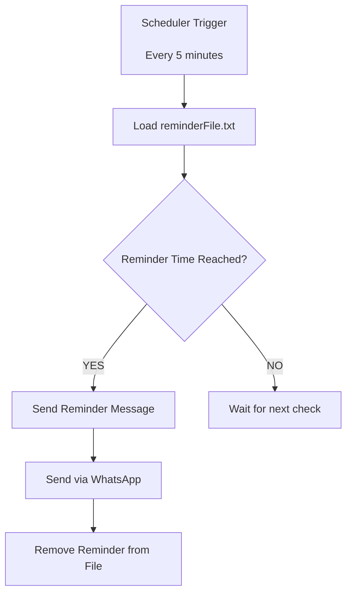
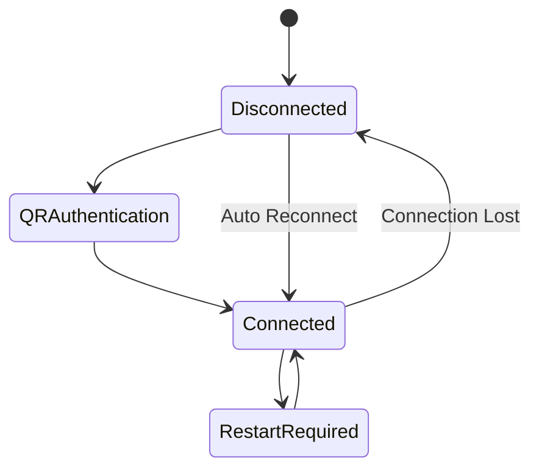

# System Architecture

## High-Level Design

CP-Boot follows a lightweight event-driven architecture designed for reliability and continuous execution.  
The system consists of four primary layers:

1. **External Data Source** – Google Calendar providing contest information  
2. **Bot Server (Node.js)** – Scheduler, processing logic, and WhatsApp client  
3. **Storage Layer** – File-based reminder storage and session state  
4. **Delivery Layer** – WhatsApp groups and users receiving notifications



---

# Data Flow

## 1. Daily Contest Notification Flow

Every day at **5:00 AM IST**, the system sends contest updates.



---

# 2. Contest Reminder Flow

The reminder system checks every **5 minutes**.



---

# Core Components

## 1. Service Layer

**File:** `startService.js`

Responsible for:

- bootstrapping the system
- initializing the scheduler
- maintaining heartbeat logs
- keeping the Node.js process alive

Heartbeat logs every **5 minutes** to confirm service health.

---

## 2. Scheduler Module

**File:** `scheduler.js`

Manages automated jobs:

| Task | Frequency |
|-----|-----|
Daily contest notifications | 5:00 AM IST |
Reminder checks | Every 5 minutes |
Connection health check | Every 5 minutes |

The scheduler coordinates all automation tasks.

---

## 3. Data Processor

**Files:**

- `getContestDetails.js`
- `sendReminder.js`

Responsibilities:

- fetch contest events from Google Calendar
- process contest metadata
- format WhatsApp messages
- create reminder entries
- manage reminder file updates

---

## 4. WhatsApp Client

**File:** `app.js`

Handles all WhatsApp communication.

Features:

- Baileys WhatsApp Web API
- persistent session authentication
- automatic reconnection
- group metadata caching
- message delivery

---

# WhatsApp Connection Architecture



Disconnect handling:

| Event | Action |
|------|------|
connectionClosed | Auto reconnect |
connectionLost | Auto reconnect |
timedOut | Auto reconnect |
restartRequired | Restart connection |
loggedOut | Re-authenticate |

---

# Storage Layer

## File-Based Storage

### WhatsApp Session

```
auth_info_baileys/
```

Contains:

- encryption keys
- session credentials
- device identity
- WhatsApp state sync data

---

### Reminder Storage

```
reminderFile.txt
```

Example:

```json
[
  {
    "time": "2026-03-08T14:05:00.000Z",
    "message": "🏆 Codeforces Round\n⏰ Time: 08:05 pm\n⏳ Duration: 3h\n🔗 https://codeforces.com/contest/..."
  }
]
```

Each reminder entry contains:

| Field | Description |
|-----|-----|
time | contest start time |
message | formatted reminder message |

---

## In-Memory Storage

### Group Metadata Cache

Using **NodeCache**:

```javascript
groupCache = new NodeCache({
    stdTTL: 300,
    useClones: false
});
```

Purpose:

- cache WhatsApp group metadata
- reduce repeated API calls
- improve performance

---

# Deployment Architecture

The bot is designed for **cloud deployment**.

Typical production setup:

```
Ubuntu Server
      │
      ▼
Node.js Runtime
      │
      ▼
PM2 Process Manager
      │
      ▼
CP-Boot Bot Service
      │
      ▼
WhatsApp Web (Baileys)
```

PM2 provides:

- process monitoring
- automatic restarts
- centralized logs
- stable long-running execution

---

# Reliability Features

CP-Boot includes several reliability mechanisms:

- automatic WhatsApp reconnection
- heartbeat service monitoring
- reminder persistence via file storage
- PM2 crash recovery
- health check scheduler

These features ensure the bot runs continuously without manual intervention.

---

# Future Architecture Improvements

Potential upgrades:

- database storage (MongoDB / PostgreSQL)
- admin dashboard
- multi-calendar support
- distributed bot instances
- webhook-based contest updates
